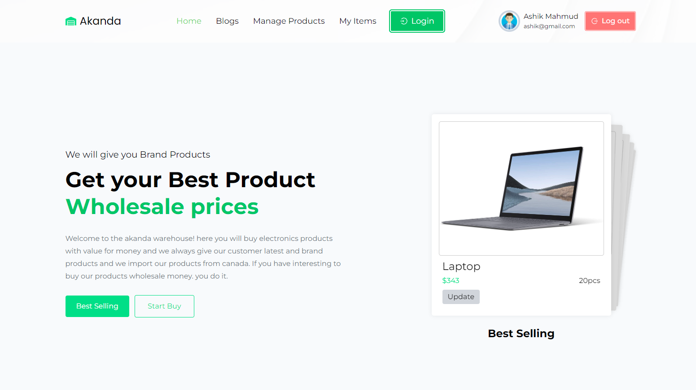

# Akanda Warehouse

This is simple electronics warehouse application using reactjs and nodejs and mongodb database. Here we can create your account by your name email and password and also can login of this application to manage your inventory. If you have any query about this project please feel free to share.

## Using Technologies

---

### Front-end

- React Js
- React Router
- Firebase
- Styled Components
- Tailwind CSS
- autoprefixer
- axios
- postcss
- react-countup
- react-reveal
- react-dom
- react-hot-toast
- react-icons
- react-router-dom
- styled-components
- sweetalert2
- swiper

### Back-end

- Node Js
- Express js
- Cors
- JsonWebToken
- MongoDB
- DotEnv

## Required Features

---

- Here you can login by your email and password and also can create an account to login and the coolest things is you can also login with your google account.
- And also allow you to reset your password
- after you login using email and password you should verify of your email to create a new product of your account. it's cool.
- Also can manage of your inventory like how many products has of your stock and also can edit your stock and added
- here you can add of your brand new product with name image short description quantity and supplier name
- also can see the current user products and manage for own like update delete and many more.
- This app completely responsive for mobile and desktop devices as well as tablet.
- Also has animation for better user experiences
- now this application allow you to create your own blog and also can manage of your blogs after successfully login.

## Website Live Link [Click Here](https://akanda-warehouse.web.app/) || <https://akanda-warehouse.web.app/>

## Preview Screenshot About this project

> Thanks for reach out me on github.
